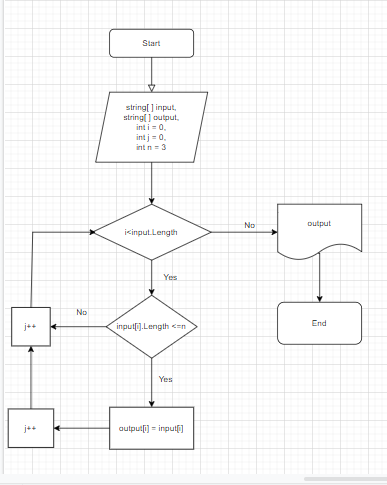

# Итоговая проверочная работа #
## Задача: ##
Написать программу, которая из имеющегося массива строк формирует новый массив из строк, 
длина которых меньше, либо равна 3 символам. 

Первоначальный массив можно ввести с клавиатуры, либо задать на старте выполнения алгоритма.
При решении не рекомендуется пользоваться коллекциями, лучше обойтись исключительно массивами.

Примеры:
// [“Hello”, “2”, “world”, “:-)”] → [“2”, “:-)”]
// [“1234”, “1567”, “-2”, “computer science”] → [“-2”]
// [“Russia”, “Denmark”, “Kazan”] → []

## Алгоритм решения ##
1. Перебираем значения исходного массива.
2. Проверяем каждое значение массива по очереди на соответствие условию: длинна строки меньше или равна 3.
3. Если условия выполняются, то данное значение кладем в новый массив.
4. Повторяем пункты 2 и 3 до тех пор пока не достигнем конца исходного массива.
5. Возвращаем новый заполнненый массив - как результат.
## Блок-схема алгоритма ##

